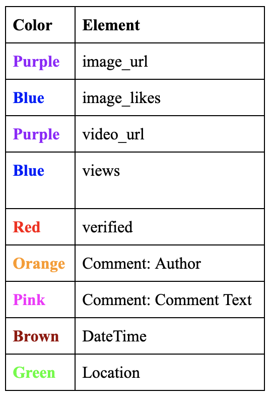
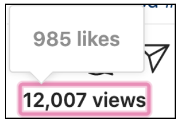

# Purpose of this code
## Instagram Layout

## Legend   
   
## Instagram Likes and Views
    

# Running the Code 
```
pip install selenium  
pip install tqdm  
pip install webdriver_manager    
```
Run the code by typing this in terminal  
```
python3 crawler.py  
```
This code has been tested and verified for working on MacOS devices. Some unknown errors in Windows appear which have not been resolved for the purposes of this project  
  

## Before running the code:  
**fetch.py** 
*Contains all functions that crawl the different parts of instagram* 
1. fetch_image_videos()  
2. fetch_videos()  
3. fetch_details_key()  
4. fetch_details()  
5. fetch_caption()  
6. fetch_mentions()  
7. fetch_hashtags()  
8. fetch_likes_plays()    

**crawler.py** 
*Main crawling code*   
1. get_user_profile()  
2. get_user_posts()  
3. _get_posts()  
4. read_file()  
5. get_video_file()  

**instagrambot.py** 
*Main Chrome Browser*
1. signIn()  
2. scroll_up()  
3. scroll_down()  
4. open_new_tab()  
5. close_current_tab()  
6. find_element_by_css()  

# Main Functionalities of crawler.py
1. Extract (num) posts from user profile: get_user_posts()  
2. Re-crawl those posts that do not contain comments: read_file()  
3. Re-crawl those posts that do not contain video_urls and image_urls: get_video_file()  

## 1) Extract (num) posts from user profile 
Things to take note
1. To crawl a desired user profile, enter this line of code in the crawler.py  
```
obj = Crawling()  
print(obj.get_user_posts("<user profile>")  )
```
2. Set num = (to a specific value), else it will crawl ALL the posts  
```
def _get_posts():
    ...
    num = <a specific number> # desired number is 1000
```
3. Change file name to save scraped data 
```
def _get_posts():
   ...
   with open('<file name>.txt', 'w') as f:  
       for item in posts:  
           f.write("%s\n" % item)  
``` 
## 2) Re-crawl those posts that do not contain comments 
```
 def read_file():  
   ...    
   def read_file(self,old,new):  
       with open(<old file name>, "r") as f:  
           new_f = open(<new file name>, "w")  
```
## 3) Re-crawl those posts that do not contain video_urls and image_urls
```
 def get_video_file():  
   ...    
   def read_file(self,old,new):  
       with open(<old file name>, "r") as f:  
           new_f = open(<new file name>, "w")  
```

## References:   
https://github.com/huaying/instagram-crawler